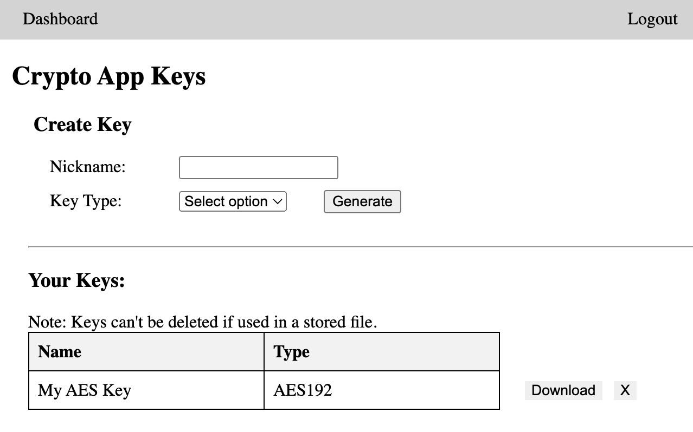
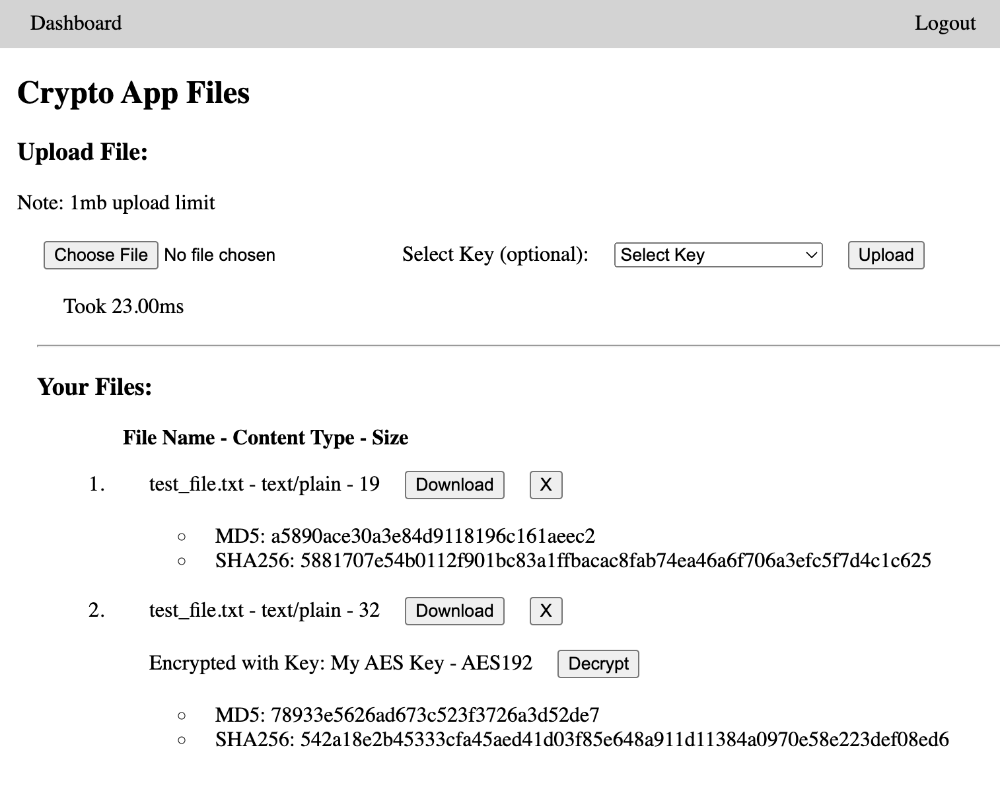

# Crypto App

This is a Spring Boot application for generating and managing encryption keys and files. The application provides a web interface for viewing and managing keys and files.

## Key Page


## File Page


## Project Setup

### Prerequisites
- Java 21
- Maven

### Running the Application
1. Clone the repository:
    ```sh
    git clone https://github.com/eddieisnotavailable/crypto_app.git
    ```
2. Navigate to the project directory:
    ```sh
    cd crypto_app
    ```
3. Create a `.env` file in the root directory of the project and add the following environment variables:
    ```ini
    DATABASE_USERNAME=your_database_username
    DATABASE_PASSWORD=your_database_password
    ```

4. Build the project:
    ```sh
    mvn clean package
    ```
5. Run the application:
    ```sh
    java -jar target/crypto_app.jar
    ```
6. Open a web browser and navigate to `http://localhost:8080`.

### Docker Setup
1. Build the Docker image:
    ```sh
    docker build -t crypto_app .
    ```
2. Run the Docker container:
    ```sh
    docker run -p 8080:8080 crypto_app
    ```

## Configuration
Configuration properties can be set in the `application.properties` file.

